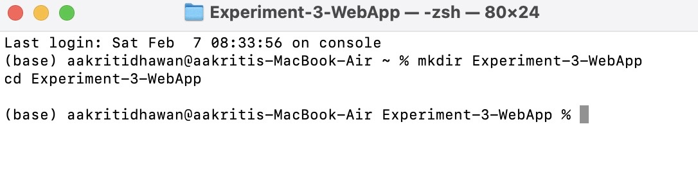
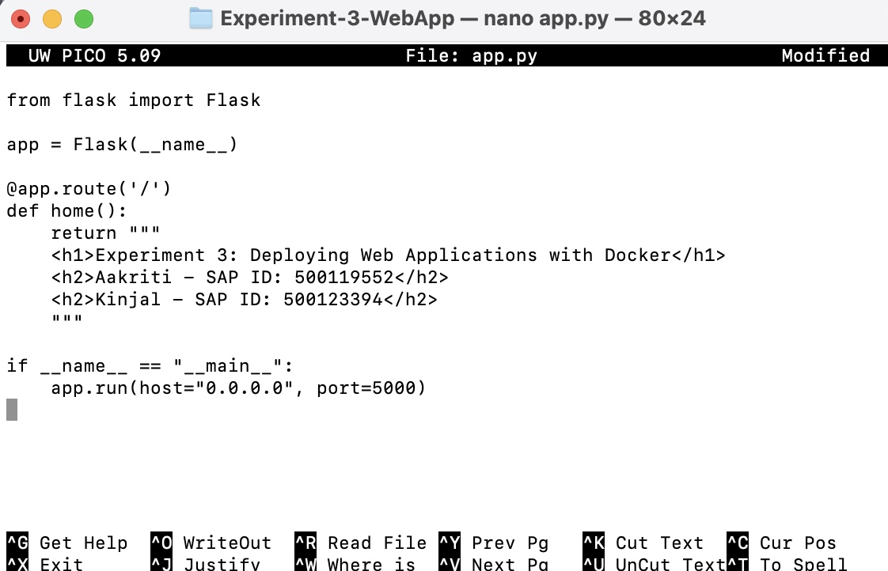
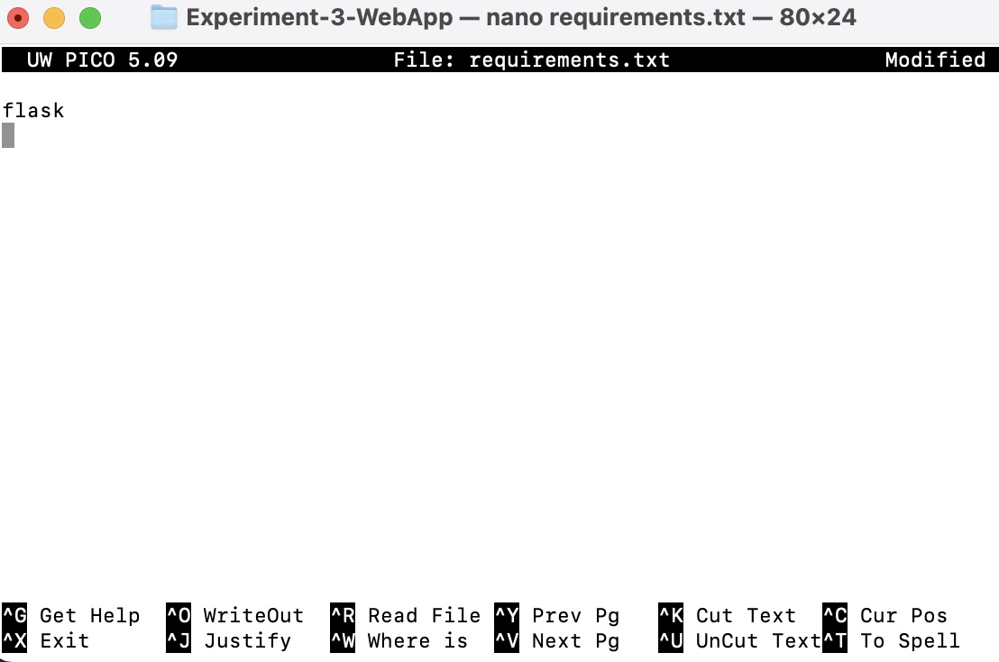
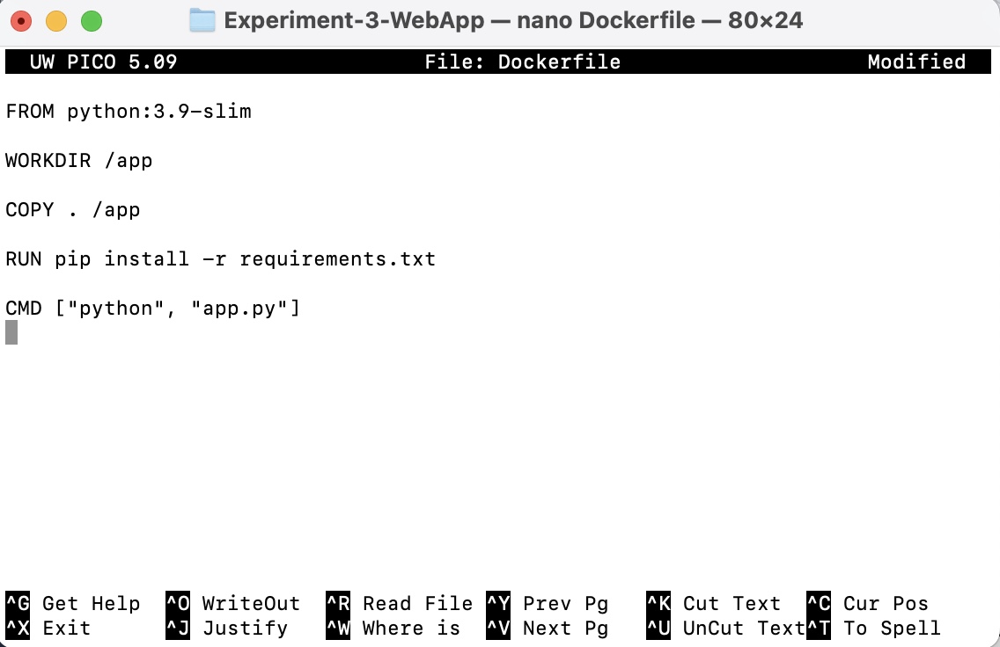
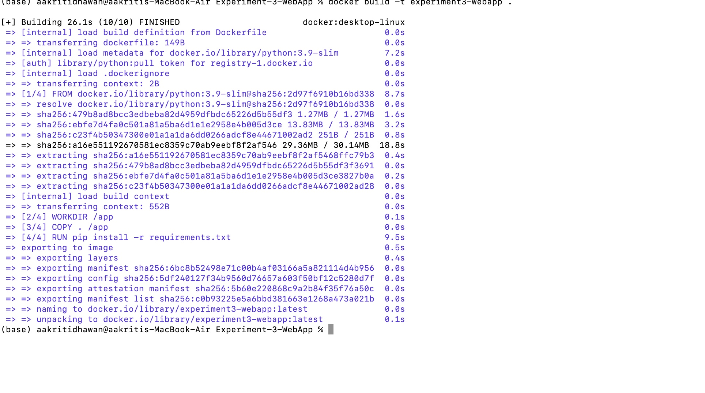
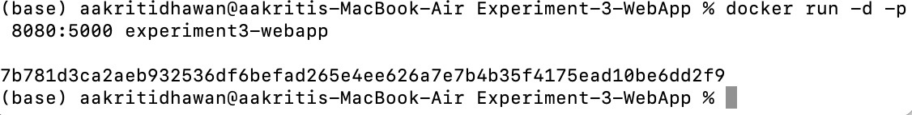
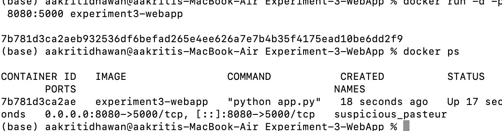
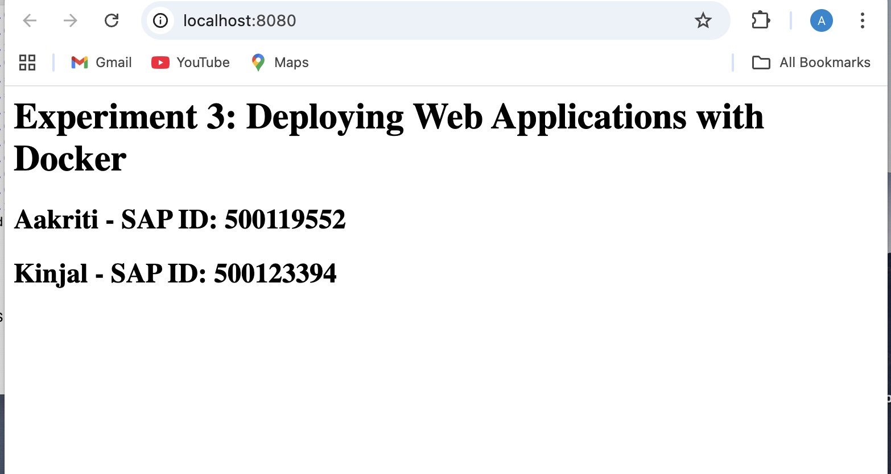
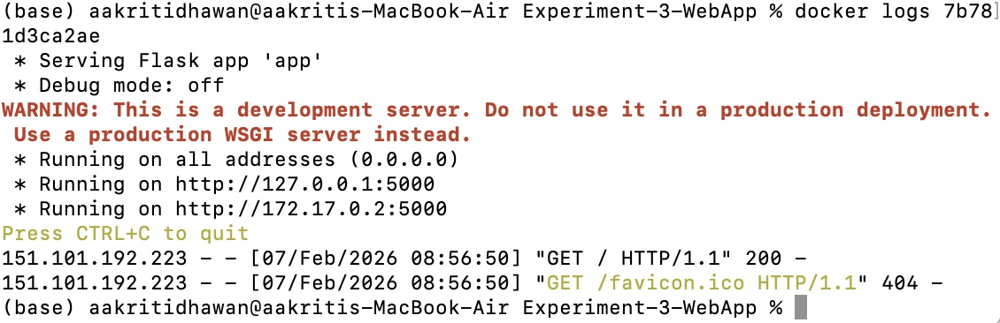

# Experiment 3: Deploying Web Applications with Docker

## Objective
This experiment demonstrates how to deploy a simple web application using Docker.  
A Flask-based web app is containerized using a Dockerfile, built into an image, and deployed inside a running container.

---

## Web Application Details

The application displays the following information:

- **Aakriti – SAP ID: 500119552**
- **Kinjal – SAP ID: 500123394**

---

## Technologies Used

- Python Flask
- Docker
- MacOS Terminal

---


##  Procedure 

---

### Step 1: Create Project Folder

```bash
mkdir Experiment-3-WebApp
cd Experiment-3-WebApp
```


### Step 2: Create Flask App (app.py)



### Step 3: Add Requirements File

Create requirements.txt


### Step 4: Write Dockerfile



### Step 5: Build Docker Image
```bash
docker build -t experiment3-webapp .
```


### Step 6: Run Docker Container
```bash
docker run -d -p 8080:5000 experiment3-webapp
```





### Step 7: Verify Deployment

Open browser:

http://localhost:8080




### Step 8: Check Logs
```bash
docker logs <container-id>
```



### Step 9: Stop the container
```bash
docker stop 7b78
1d3ca2ae
```


## Result

The Flask web application was successfully containerized and deployed using Docker.
It ran correctly inside a Docker container and was accessible through a web browser.

## Conclusion

Containerizing web applications ensures portability, consistency, and ease of deployment across environments.
Docker makes it simple to package and run applications anywhere without dependency issues.