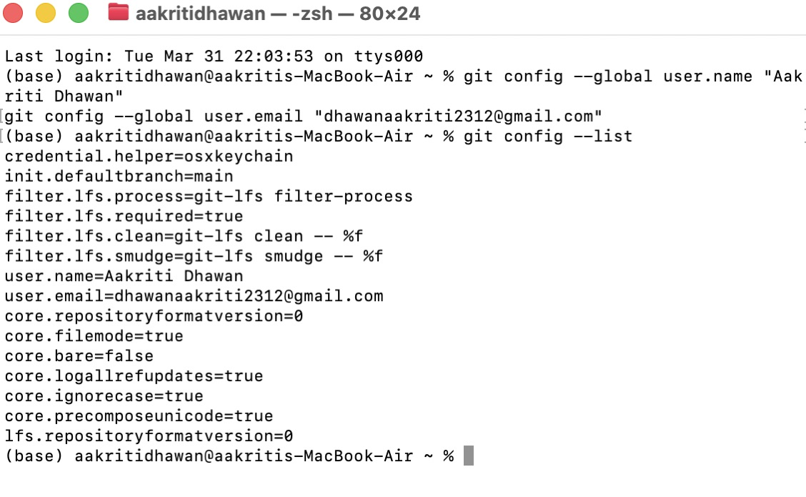
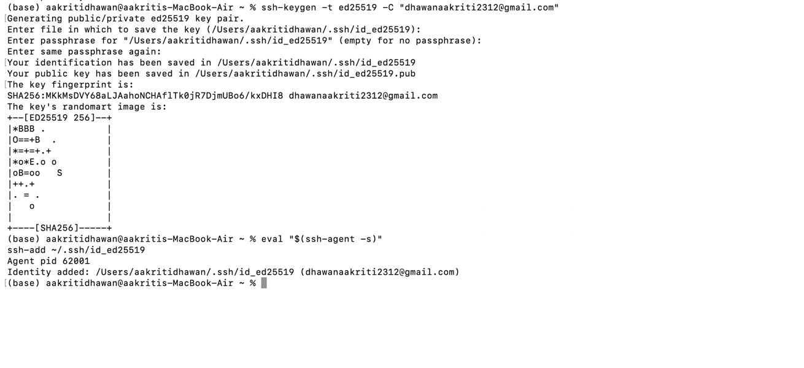
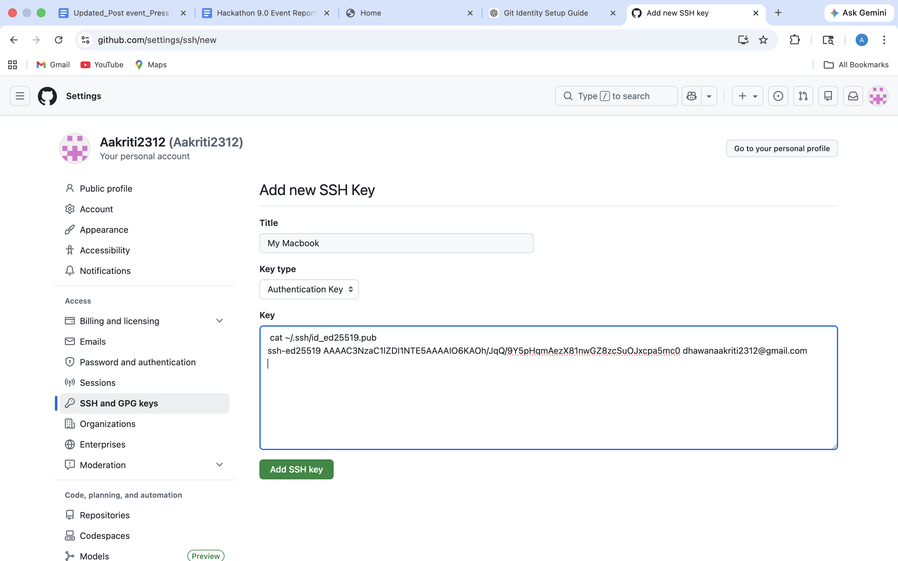
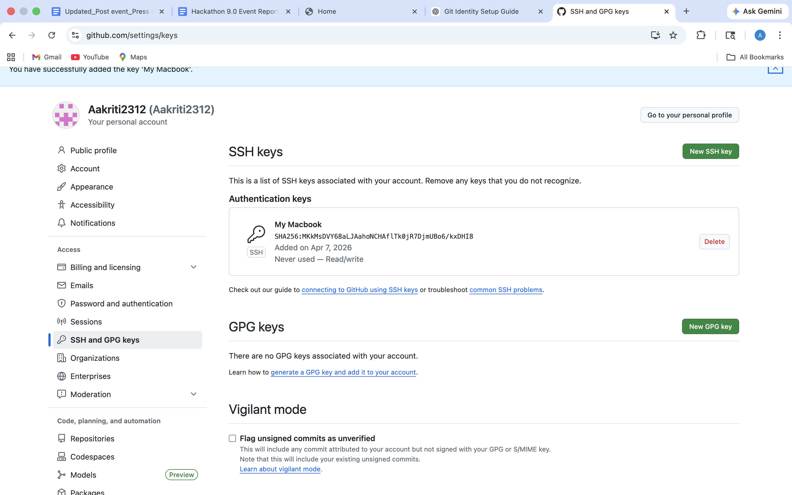
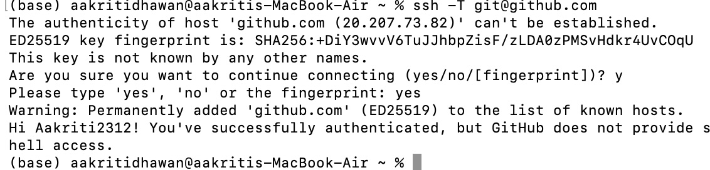
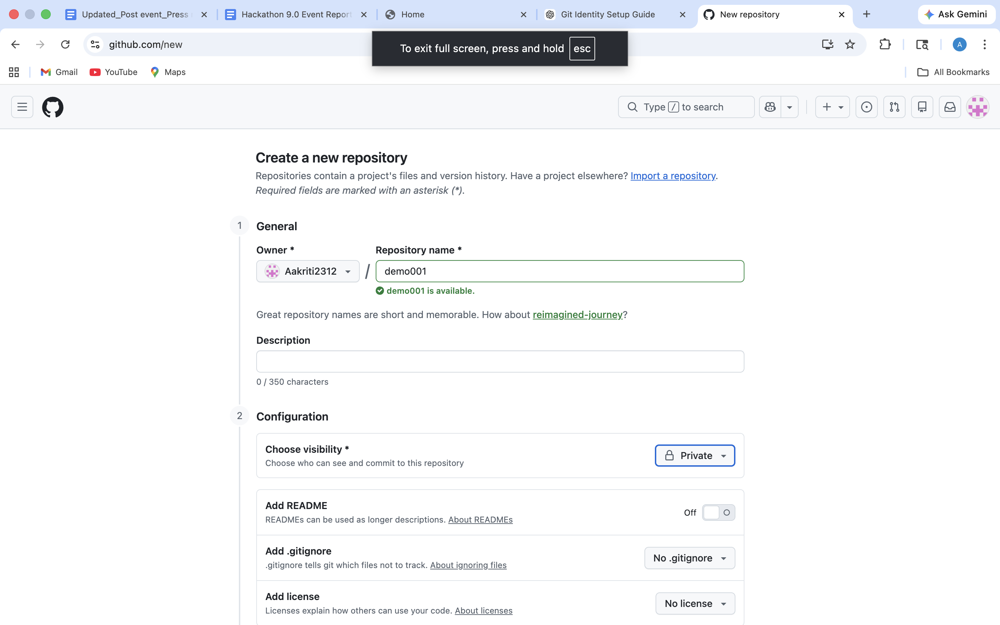

# Git Hands-on: Identity Setup, SSH Authentication & GitHub Connection

##  Objective

To configure Git identity and authentication so that commits and remote operations work correctly using SSH with GitHub.

---

## Step 1: Configure Git Username and Email

These details are attached to every commit and help in tracking contributions.

```bash
git config --global user.name "Your Name"
git config --global user.email "your-email@example.com"
```

### Verify Configuration:

```bash
git config --list
```

---

##  Step 2: Generate SSH Key

SSH keys allow secure communication with GitHub without entering passwords repeatedly.

```bash
ssh-keygen -t ed25519 -C "your-email@example.com"
```

* Press **Enter** to accept default location
* Optionally set a passphrase

---

##  Step 3: Start SSH Agent and Add Key

```bash
eval "$(ssh-agent -s)"
ssh-add ~/.ssh/id_ed25519
```

---

## Step 4: Copy SSH Public Key

```bash
cat ~/.ssh/id_ed25519.pub
```

Copy the entire output.

Then go to GitHub → Settings → SSH and GPG Keys
Add a new SSH key and paste the copied key.



---

##  Step 5: Test SSH Connection

```bash
ssh -T git@github.com
```


### Expected Output:

```
Hi username! You've successfully authenticated...
```


---

##  Step 6: Create Repository on GitHub

* Repository Name: `demo001`
* Visibility: Private
* Do NOT select README, .gitignore, or License

---

##  Step 7: Initialize and Push (Fresh Repository)

```bash
echo "# demo001" >> README.md
git init
git add README.md
git commit -m "first commit"
git branch -M main
git remote add origin git@github.com:username/demo001.git
git push -u origin main
```

---

## Step 8: Push Existing Repository

```bash
git remote add origin git@github.com:username/demo001.git
git branch -M main
git push -u origin main
```


---

## Managing Remote Repository

### Check Remote:

```bash
git remote -v
```

### Add Remote:

```bash
git remote add origin git@github.com:username/demo001.git
```

### Remove Remote:

```bash
git remote remove origin
```

### Change Remote URL:

```bash
git remote set-url origin git@github.com:username/new-repo.git
```

---


## Conclusion

* Git identity was configured using username and email
* SSH authentication was set up for secure access
* Repository was successfully connected and pushed to GitHub
* Remote repository management commands were executed

---

##  Key Takeaways

* SSH eliminates the need for passwords
* Proper configuration ensures correct commit history
* Essential for real-world development workflows

---
