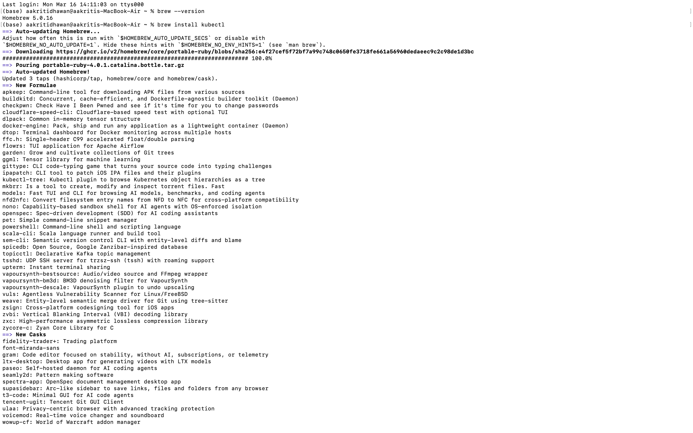
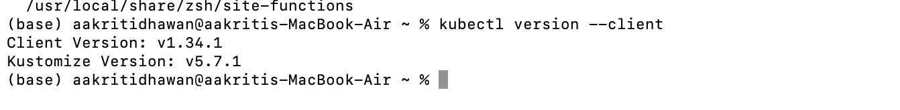
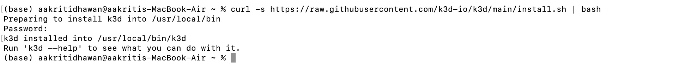
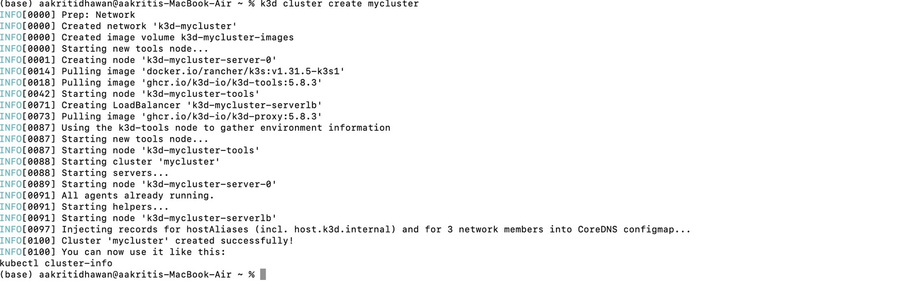
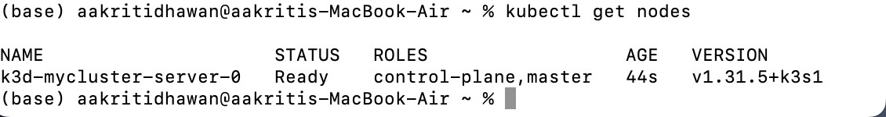
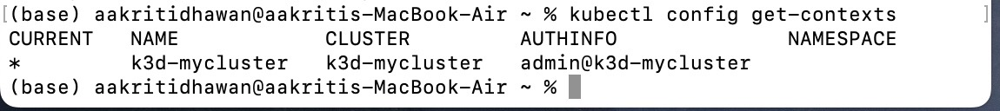
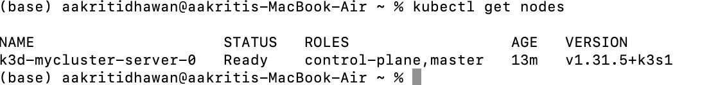

# Kubernetes Setup & kubectl Connectivity  
Date: 18-03-2026 

##  Recommended Stack (macOS)

- Terminal (built-in Unix environment)
- Homebrew (package manager)
- kubectl (Kubernetes CLI)
- Docker Desktop (required for k3d)
- k3d (lightweight Kubernetes cluster)
- Lens (optional GUI)

---

##  Installation Steps

### 1. Install Homebrew (if not installed)

```bash
/bin/bash -c "$(curl -fsSL https://raw.githubusercontent.com/Homebrew/install/HEAD/install.sh)"
```

Verify:
```bash
brew --version
```
### 2. Install kubectl
```bash
brew install kubectl
```


Verify:
```bash
kubectl version --client
```

### 3. Install k3d
```bash
curl -s https://raw.githubusercontent.com/k3d-io/k3d/main/install.sh | bash
```

Verify:
```bash
k3d version
```

### 4. Create Kubernetes Cluster
```bash
k3d cluster create mycluster
```


Verify Cluster
```bash
kubectl get nodes
```


## How kubectl Connects to a Cluster

kubectl is a client tool

It does not run a cluster

It communicates with an existing Kubernetes cluster

## Where Clusters Can Exist

Local machine (k3d, minikube)

Remote servers

Cloud platforms:

AWS EKS

Google GKE

Azure AKS

On-premise data centers

### kubeconfig File

kubectl uses a configuration file to connect to clusters.

Default location:

~/.kube/config
##  What kubeconfig Stores

Cluster address (API server)

Authentication credentials

Context information (cluster + user)

## Connection Flow
kubectl → kubeconfig → context → API server → cluster
###  View Available Clusters (Contexts)
```bash
kubectl config get-contexts
```

### Display nodes in a cluster
```bash
kubectl get nodes  
```
