# Kubernetes Hands-on with k3d and kubectl  
Date: 19-03-2026  

---


##  Step 1: Create Kubernetes Cluster

```bash
k3d cluster create mycluster1
```
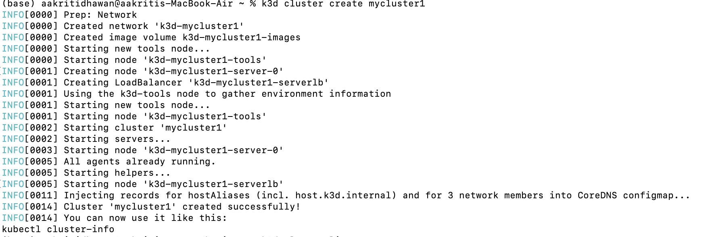

### List Available Clusters
```bash
k3d cluster list
```
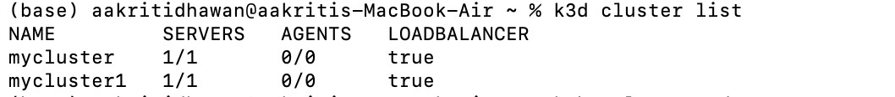

### Check Cluster Nodes
```bash
kubectl get nodes
```
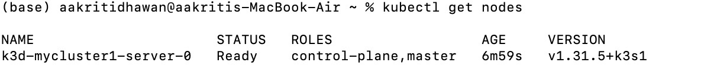

### Check Pods (Initial State)
```bash
kubectl get pods
```
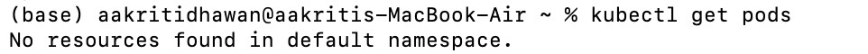

## Step 2: Create a Pod
```bash
kubectl run nginx --image=nginx
```
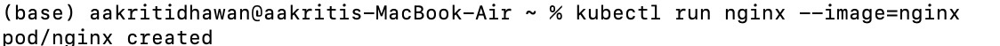

### Describe Pod
```bash
kubectl describe pod nginx
```
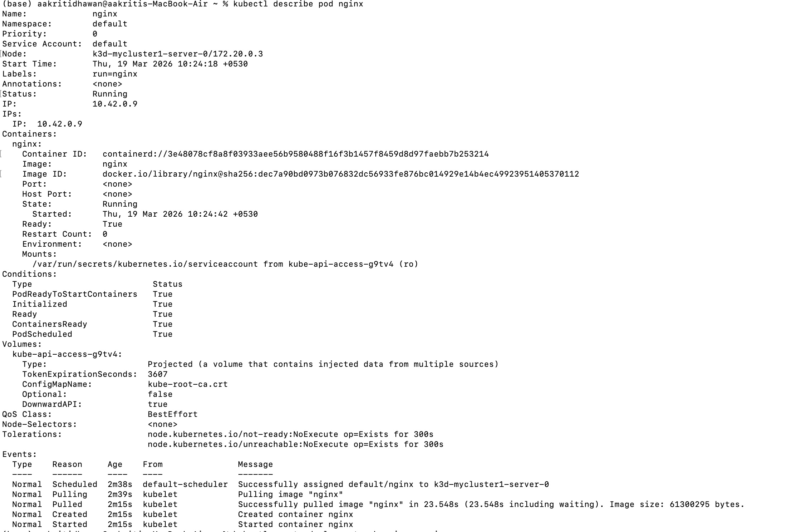

## Step 3: Create Deployment
```bash
kubectl create deployment web --image=nginx
```
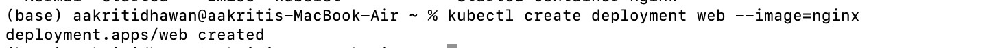
### Scale Deployment
Scale to 3 replicas:
```bash
kubectl scale deployment web --replicas=3
```
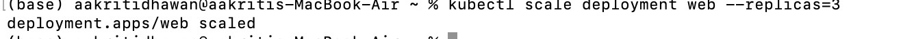

### Check pods:
```bash
kubectl get pods
```
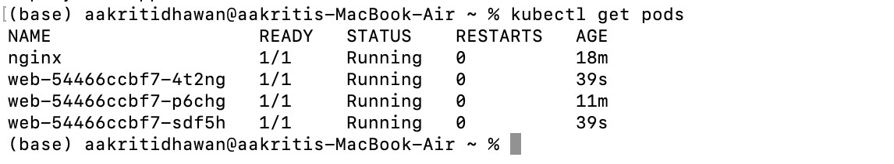
### Scale down to 2 replicas:
```bash
kubectl scale deployment web --replicas=2
```
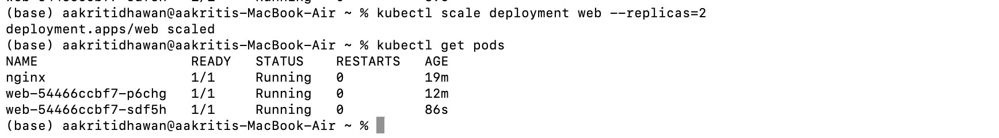

## Step 4: Expose Deployment
```bash
kubectl expose deployment web --port=80 --type=NodePort
```
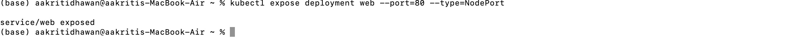

### Check Services
```bash
kubectl get services
```
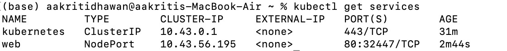

### Access Application
```bash
kubectl port-forward services/web 8080:80
```
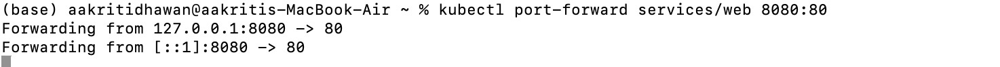

### Open in browser:
```bash
http://localhost:8080
```
## Cleanup Resources
Delete Pod:
```bash
kubectl delete pod nginx
```
Delete Deployment:
```bash
kubectl delete deployment web
```
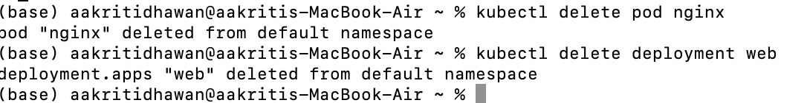

## How kubectl Connects to Cluster

kubectl is a client tool

It connects to clusters using a configuration file

Default file:
~/.kube/config
Stores:

Cluster details

Authentication info

Contexts
